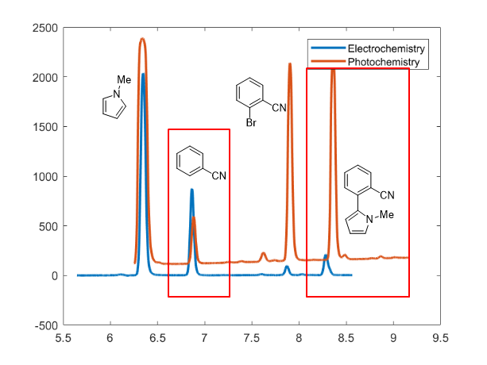

# Electrochemical reduction of nitrobenzene in flow cell

> Experiment info:
>
> Time: 2020/08/15

## Reagent preparation

| Name         | Concentration (M) | MW     | Weight (g) | Density (g/ml) | Volume | Actual |
| ------------ | ----------------- | ------ | ---------- | -------------- | ------ | ------ |
| Nitrobenzene | 0.1               | 123.11 | 0.1231     | /              | /      | 0.1265 |
| LiClO~4~     | 0.1               | 106.4  | 0.1064     | /              | /      | 0.1030 |
| Acetone      |                   |        |            |                | 10 mL  |        |

## Experiment procedure

The flowrate was 0.15 mL/min and temperature was 40 C. Potential was set at 1.6 V... ...

## Results and discussion

The HPLC yield of this reaction is 76%... ...

