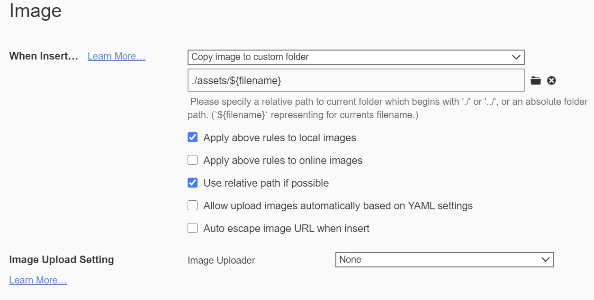
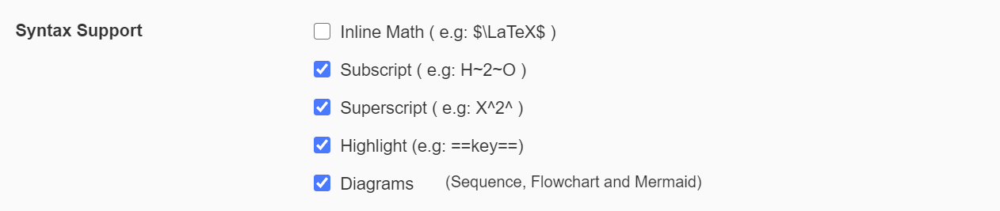
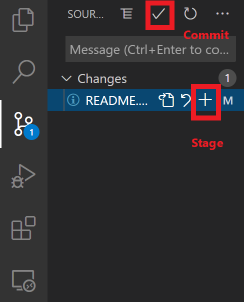

# 莫一鸣课题组电子实验记录本（ELN）使用说明

> Version history:
>
> *v0.1: 2020/08/08 edited by Yiming Mo*

## 介绍

电子实验记录本，**E**lectronic **L**aboratory **N**otebook (ELN)，为了简化流程，实现最方便的实验记录与查询，主要由两个部分组成：

1. 利用Markdown的文本格式，简化实验记录时文字格式的调整，从而专注于内容本身；
2. 利用Git进行版本控制，实现实验记录的云端同步，保证记录不丢失、保存修改记录历史，确保实验数据的历史可见性，同时为多人合作的项目提供简便的文件版本控制。

## 安装流程

ELN所需要的软件如下：

- Typora (Markdown editor): https://typora.io/
- VS Code (Markdown and code editor + Git version control): https://code.visualstudio.com/

理论上VS Code 单独已经可以实现所需的所有功能，但Typora对于编辑Markdown文档的的界面更加简洁，操作更加简单省时间，因而推荐二者联合使用。

### Typora安装与设置

#### Typora安装

Typora提供Windows，Linux，Mac三个平台的安装，根据平台选择下载安装即可。

#### Typora设置

下载完成之后，进行如下设置(File &rarr; Preferences ...)：

1. 自动保存 (General &rarr; Autosave)：打开从而避免忘记保存；

2. 字体与格式设置 (Appearance &rarr; Open Theme Folder)： 将本文件夹内的“base.user.css”文件和“fonts”文件夹复制进Theme Folder里（为了控制字体和格式，后期也可以根据自己的喜好进行定制）；

3. 图片设置(Image)：Typora支持直接将图片复制进编辑器，为了统一图片的路径，利用以下设置，图片会自动保存到同一路径下"assets/$filename/xxx.jpg"；

   

4. 打开上下标(Markdown editor)：因为Markdown不直接支持上下标，这是Typora自带的一个功能，上下标在化学里经常使用（e.g., CaCO~3~），启动该功能；

   

5. 主题：建议在记录时使用黑色主题保护眼睛（Dark notes，需要额外下载 http://theme.typora.io/ ），在做展示时利用白色主题（Github）。


### Vscode的安装与设置

#### VS Code的安装

请前往 https://code.visualstudio.com/ 下载最新版的VS Code编辑器，同时前往 https://git-scm.com/ 下载Git版本控制软件，按照default设置安装即可。

#### VS Code的设置

VS Code的功能主要是由设置与插件提供的，插件在Extension处安装：


- 如果不习惯英文界面，可以安装中文翻译插件，在插件里搜索"Chinese (Simplified) Language Pack for Visual Studio Code"。不过还是建议用英文。
- 安装"Markdown All in One"和"Markdown Preview Enhanced"插件

## 使用流程

### 创建一个实验记录本的Repository (Repo)

目前先在Gitee上作为测试（由于Github在国内连接太慢），到正式运行时，实验室会自行运行保密的Git服务器，保证实验数据不被公开。

- 在Gitee上注册，并创建一个新的repo，repo名字只能是英文；
- 创建之后，将该repo Clone到本地的文件夹中，点“Code”，“Clone with HTTPS”
- 进入VS Code，进入Source Control版块，然后点击Clone，粘贴上述地址，选择保存的文件夹即可。

### Typora的使用

利用Typora打开上述文件夹，在里面创建新的笔记。

Typora使用相对比较直观，具体细节教程请见Help文件，常用功能如下：

待补充 ... ...

### VS Code的使用

- 在利用Typora编辑完新的实验记录之后，打开VS Code，打开试验记录的文件夹；
- 在Source Control的版块会显示你所做的变化。利用“+”去Stage这个变化（确认你需要把编辑的内容Push到服务器上），在Stage完所有的需要Push的内容（一般情况就是Stage所有的变化）；
- 然后点“Commit”键，这时候需要添加Commit的描述，比如“优化反应条件”；

- 最后点Push，这样所有的内容就会被推送到服务器上。

  

如果在多台电脑上进行编辑，或者与其他同学合作同一个项目，在每次编辑新的实验内容之前就行Pull或者Sync，以确保服务器上的最新内容被更新到本地的文件上。

## 实验记录规范

待补充... ...

## Appendix (仅为编程的同学参考)

### Use Anaconda in Windows

#### Enable conda in Windows powershell

1. Open your Anaconda prompt (i.e. the command line, not the Navigator) and execute the command.

   ```powershell
   conda init powershell
   ```

2. There might be some problems to run the anaconda scripts with this error appearing: 

   ```
   ps1 cannot be loaded because running scripts is disabled on this system
   ```

   This could be due to the current user having an undefined `ExecutionPolicy`.

   You could try the following:

    ```powershell
    Set-ExecutionPolicy -Scope CurrentUser -ExecutionPolicy Unrestricted
    ```